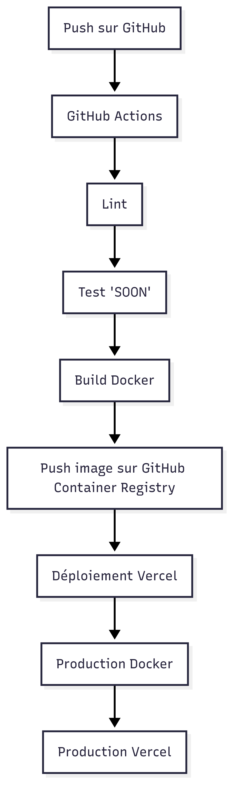

# Portfolio – Allan Lannoy

[](https://allan-lannoy-portfolio.vercel.app)
[](https://github.com/AllanLny/Portfolio/stargazers)
[](https://github.com/AllanLny/Portfolio/network/members)
[](https://github.com/AllanLny/Portfolio/pulls)
[](https://github.com/AllanLny/Portfolio/issues)
[](https://github.com/AllanLny/Portfolio/graphs/contributors)
[](https://github.com/AllanLny/Portfolio/blob/master/LICENSE)

[](https://github.com/AllanLny/Portfolio/actions/workflows/docker-build.yml)
[](https://github.com/AllanLny/Portfolio/actions/workflows/verify-linter.yaml)

Bienvenue sur mon portfolio DevOps & FullStack !  
Ce projet met en avant mes compétences en développement web moderne, CI/CD, conteneurisation, cloud et automatisation.


[](https://github.com/AllanLny/Portfolio/pkgs/container/portfolio)


---

##  Aperçu

- **Stack Frontend** : React 18, Vite, SCSS, TanStack Query
- **CI/CD** : GitHub Actions (lint, build, déploiement Docker & Vercel)
- **Conteneurisation** : Docker multi-stage, Nginx
- **Déploiement** : Vercel (prod), GitHub Container Registry (image Docker)
- **Qualité** : ESLint, tests automatisés (à venir)
- **Effets UI** : Liquid glass, animations, responsive design

---

##  Installation & développement

```bash
git clone https://github.com/AllanLny/Portfolio.git
cd Portfolio
cp .env.example .env 
npm install
npm run dev
```

Accédez à [http://localhost:8080](http://localhost:8080)

---

##  Variables d'environnement

Créez un fichier `.env` à la racine :

```
VITE_EMAILJS_SERVICE_ID=...
VITE_EMAILJS_TEMPLATE_ID=...
VITE_EMAILJS_PUBLIC_KEY=...
```

---

##  Build & exécution Docker

**Build de l'image :**
```bash
docker build -t allan-portfolio .
```

**Lancer le conteneur :**
```bash
docker run -p 8080:80 allan-portfolio
```

---

##  Stack DevOps

- **CI/CD** : Automatisation via [GitHub Actions](.github/workflows/docker-build.yml) et [déploiement Vercel](.github/workflows/deploy-frontend.yml)
- **Docker** : Build multi-stage, image optimisée, Nginx custom ([Dockerfile](Dockerfile), [nginx.conf](nginx.conf))
- **Monitoring** : Vercel Analytics
- **Sécurité** : Headers HTTP, gestion des secrets via GitHub Actions, .env non versionné

---

## Architecture CI/CD



##  Structure du projet

```
.
├── public/           # Fichiers statiques (robots.txt, sitemap.xml, images, CV)
├── src/              # Code source React
│   ├── components/   # Composants UI
│   ├── pages/        # Pages principales
│   ├── api/          # Appels API (mock)
│   ├── data/         # Données statiques (projets, recommandations)
│   └── styles/       # Styles globaux SCSS
├── .github/workflows # Workflows CI/CD
├── Dockerfile        # Build et exécution Docker
├── nginx.conf        # Configuration Nginx custom
├── vite.config.ts    # Config Vite
└── README.md
```

---

## Déploiement

- **Production** : [allan-lannoy-portfolio.vercel.app](https://allan-lannoy-portfolio.vercel.app)
- **Docker** : Image publiée sur GitHub Container Registry

---

## Monitoring & observabilité

- **Vercel Analytics** : Pour le trafic et la performance

---

## SEO & Accessibilité

- Sitemap et robots.txt générés ([public/sitemap.xml](public/sitemap.xml), [public/robots.txt](public/robots.txt))
- Métadonnées SEO, Open Graph, Twitter Card
- Responsive design

---

## Auteur

**Allan Lannoy**  
[LinkedIn](https://www.linkedin.com/in/allanlannoy/) • [GitHub](https://github.com/AllanLny)

---

## Licence

Ce projet est open source sous licence MIT.
